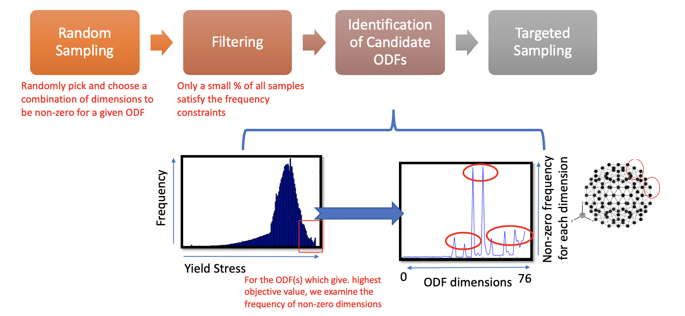

# microstructure-optimization-sampling
Microstructure optimization of constrained design objectives using data-driven sampling approaches

  

## Requirements 

* MATLAB 9.2.0.556344 (R2017a) or above 
* Python 2.7.1 or above

## Citation
If you use this code or data, please cite:

Arindam Paul, Pinar Acar, Ruoqian Liu, Wei-keng Liao, Alok Choudhary, Veera Sundararaghavan, Ankit Agrawal. Data Sampling Schemes for Microstructure Design with Vibrational Tuning Constraints. Journal of American Institute of Aeronautics and Astronautics, 2018 

## Developer Team & Collaborators 

The code was developed by the <a href="http://cucis.ece.northwestern.edu/">CUCIS</a> group at the Electrical and Computer Engineering Department in Northwestern University. The development team would like thank the collaborators <a href="https://www.me.vt.edu/people/faculty/pinar-acar/">Prof. Pinar Acar</a> at Virginia Tech and <a href="https://aero.engin.umich.edu/people/veera-sundararaghavan/">Prof. Veera Sundararaghavan</a>. 

## Questions/Comments:
email: apaul@u.northwestern.edu
Copyright (C) 2019, Northwestern University.
See COPYRIGHT notice in top-level directory.

## Funding 

This work is supported primarily by the AFOSR MURI award FA9550-12-1-0458. Partial support is also acknowledged from the following grants: NIST award 70NANB14H012; NSF award CCF-1409601; DOE awards DE-SC0007456, DE-SC0014330; and Northwestern Data Science Initiative.
